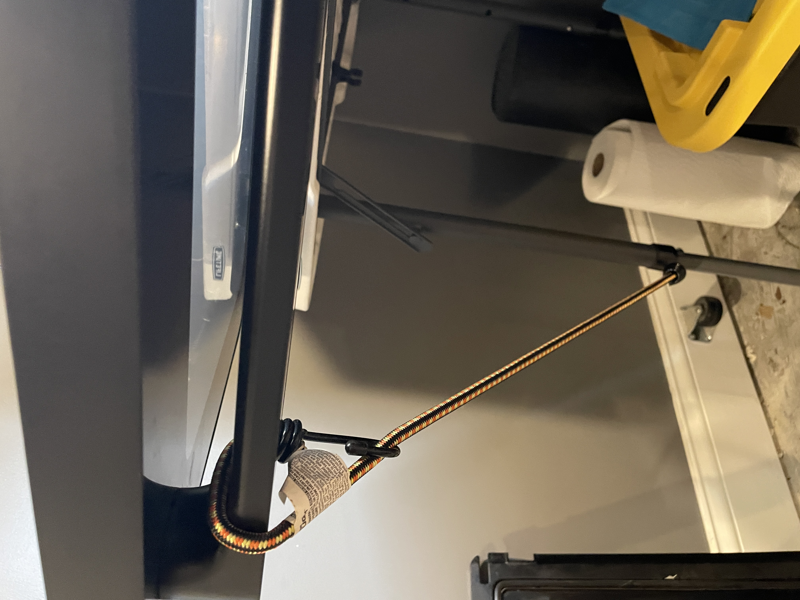
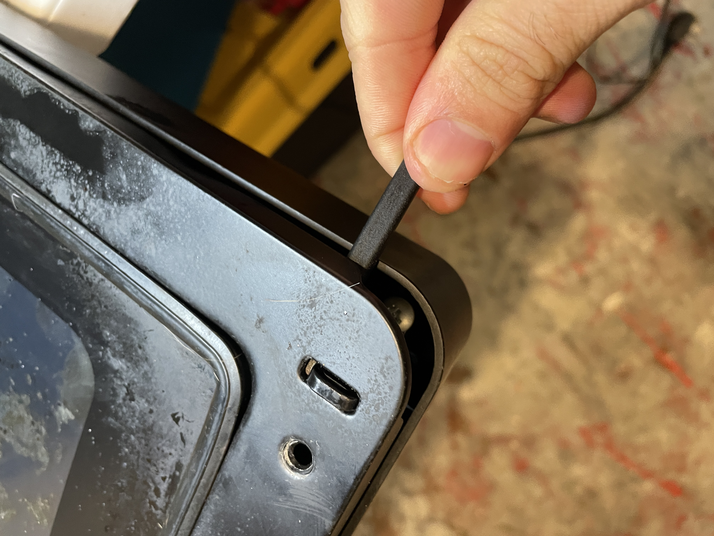
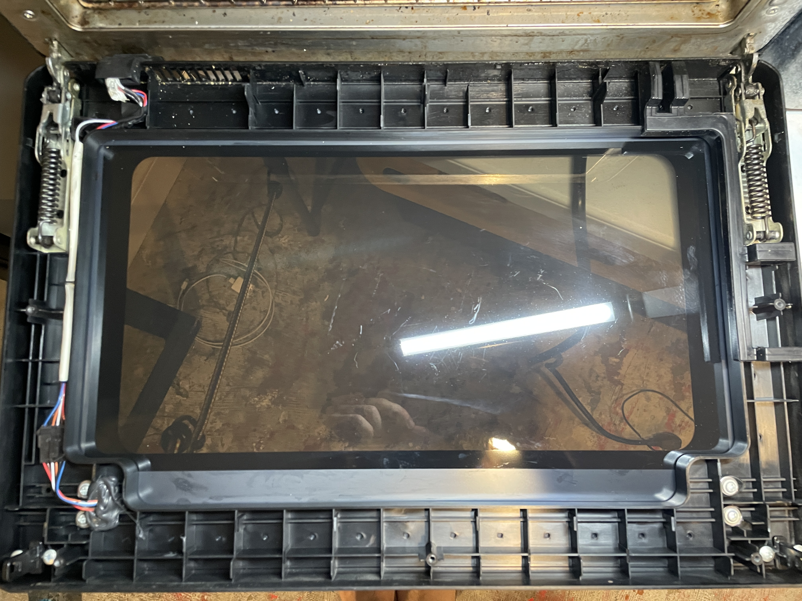
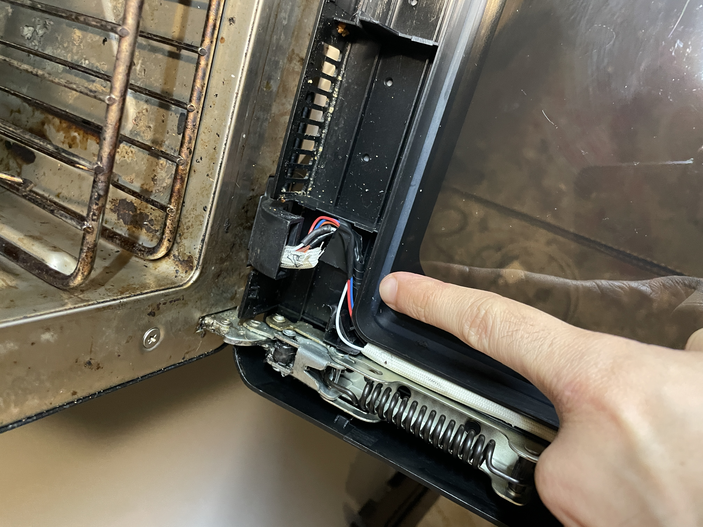
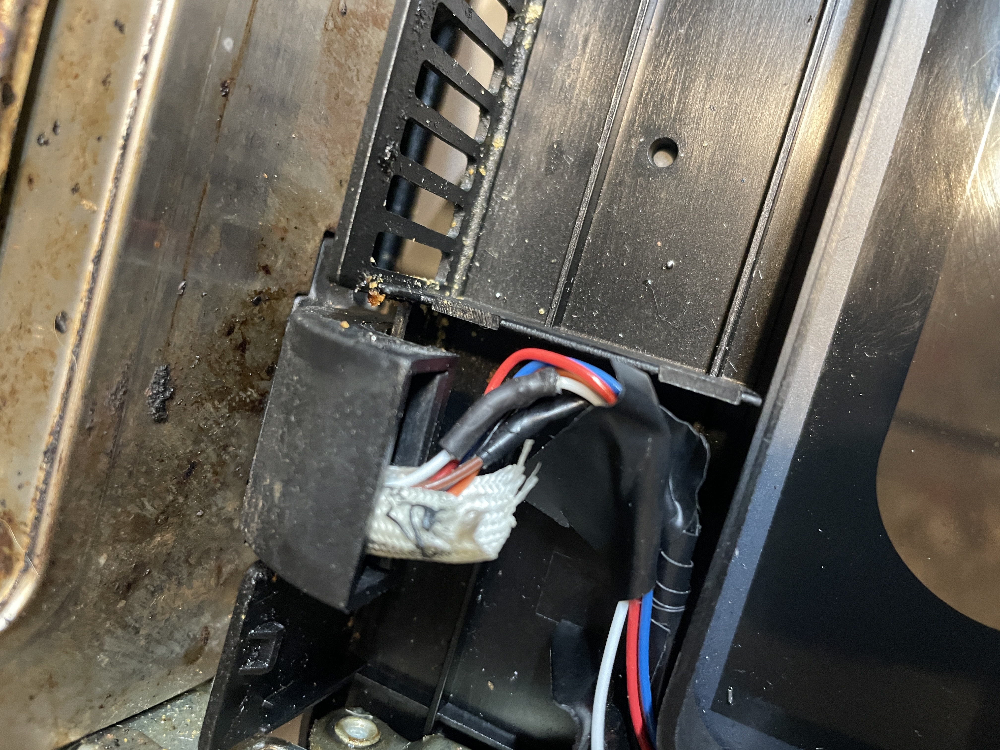
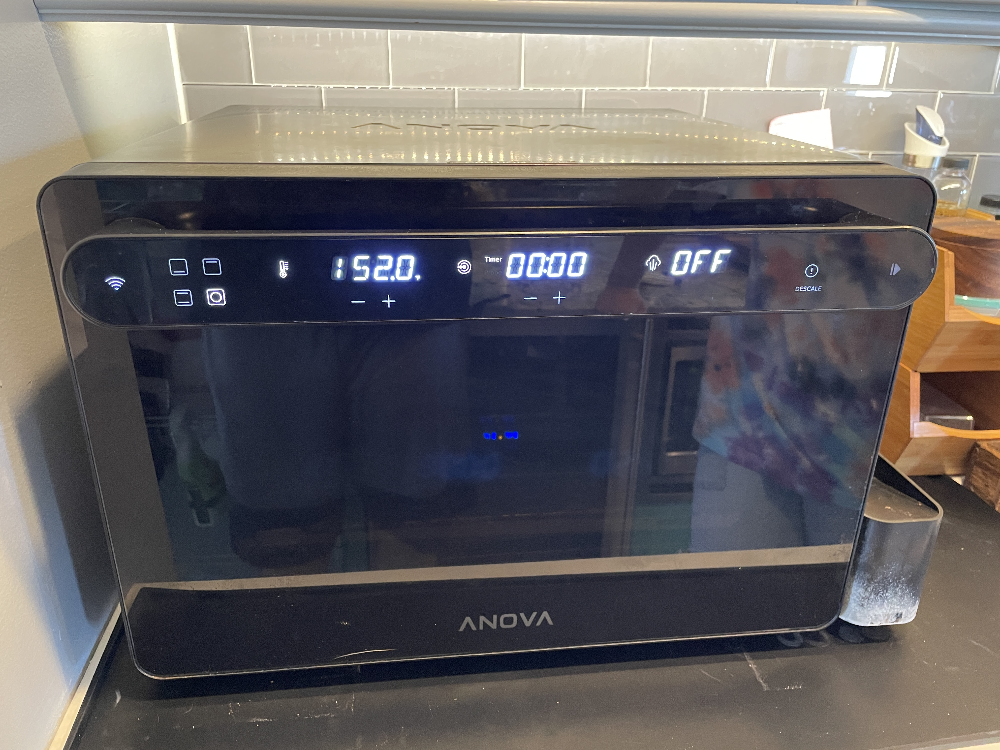

## How I Saved $600 by Fixing My Anova Precision Oven's Dead Display

So your fancy Anova Precision Oven suddenly has a dead display? Before you shell out $600+ for a replacement, there's a good chance you can fix it yourself with basic tools and about 30 minutes of your time!

{/* truncate */}

## The Problem

The Anova Precision Oven has a common design flaw where the wires connecting to the display can become severed during normal use. This typically happens after opening and closing the door repeatedly over time. When these wires break, your display goes completely dark, making the oven unusable.
I faced this exact issue after about 18 months of ownership. Instead of trashing an otherwise perfect appliance, I decided to investigate - and the fix turned out to be surprisingly simple!

## What You'll Need

- Phillips screwdriver
- Plastic spudger tool and/or flat-head screwdriver
- Soldering iron and solder
- Heat shrink tubing
- Heat-resistant electrical tape
- *Alligator clips (optional, for testing)*
- *String or cord (optional, to keep the door open during repair)*

## A Note of Encouragement
I know electrical repairs can seem intimidating if you've never done them before. I was hesitant too! But this is genuinely one of the simplest electrical fixes you can perform. The wires are low voltage, well-isolated, and easy to access. 
If you can plug in a toaster and operate a screwdriver, you can absolutely handle this repair. That said, if you're truly uncomfortable, taking it to a repair shop is still vastly cheaper than replacement. Especially if you provide this guide!

## The Repair Process

### Step 1: Removing the Oven Door's Heat Shield 

1. **Open the oven door fully**. Locate and remove the 5 screws from the top side of the oven door.

2. **Remove the top cover** of the oven door.
:::tip Pro Tip
The top cover is held in place by friction. Use a flat head screwdriver or a [plastic spudger tool](https://www.amazon.com/plastic-spudger/s?k=plastic+spudger) to gently pry the top cover off. Work slowly around the edges to avoid cracking the plastic.
:::

:::warning Door Hack
**IMPORTANT:** Tie down the door with something like I did below! Once the heat shield is removed, the door will constantly try to close on you, making repairs frustrating. A simple piece of string saves a lot of headaches.

:::

Here's the spudger tool I used:

The best places to begin prying are shown below:

3. When properly removed, your door should look like this:

### Step 2: Locating and Fixing the Severed Wires
:::tip Trust But Verify
Before committing to soldering, I recommend testing the wires first! I connected alligator clips to each end of the severed wires (being careful not to short anything) to verify this was indeed the issue. When connected, my display immediately came to life once I plugged it in!
:::

1. **Examine the bottom left corner** of the oven to find the wiring harness. You'll likely see a white plastic harness with severed wires. In my case, the brown and white wires were the culprits.

2. **Strip and solder** the wires back together. Protect your connections with heat shrink tubing and heat-rated electrical tape to prevent future shorts.

:::tip Don't Fear Soldering!
I used the [Fanttik T1 Max Soldering Iron Kit](https://fanttik.com/products/fanttik-t1-max-soldering-iron-kit?_pos=1&_sid=ab707b9cf&_ss=r), but any basic soldering iron will work. This was only my second time soldering wires, and it was surprisingly easy! Just take your time and watch a quick YouTube tutorial if you're nervous.
:::

Here's how my repair looked:

### Step 3: Testing Your Repair

The moment of truth! Simply plug the oven back in and turn it on. If the display lights up, 
**congratulations** you've successfully fixed your oven!

### Step 4: Reassembling the Oven Door

1. Reverse the disassembly steps to put everything back together. **Don't forget to remove your door tie before closing it!**

2. **Congratulations!** You've just saved yourself approximately $600 USD and kept a perfectly good appliance out of the landfill. Your wallet (and the environment) thank you!

## Closing Thoughts

This repair highlights how many "broken" modern appliances can be fixed with simple DIY solutions. The Anova Precision Oven is an excellent product with this one design flaw, and now yours should provide many more years of perfectly cooked meals!

Have you repaired other kitchen appliances? Let me know in the comments below!

## Sources & Additional Resources

I wasn't the first person to discover this issue, and I'm grateful to those who shared their experiences online. These resources helped guide my repair:

- [Reddit Discussion](https://www.reddit.com/r/CombiSteamOvenCooking/comments/1auwq8x/my_apos_touchpanel_digitizer_has_been_acting/) - A thread in r/CombiSteamOvenCooking where users discussed similar display problems with their APOs
  
- [How to DISASSEMBLE ANOVA Precision Oven](https://www.youtube.com/watch?v=Ah-ilH4Rtb0) - Helpful YouTube tutorial showing the complete disassembly process

If you've found other resources or have alternative repair methods, feel free to share them in the comments!
