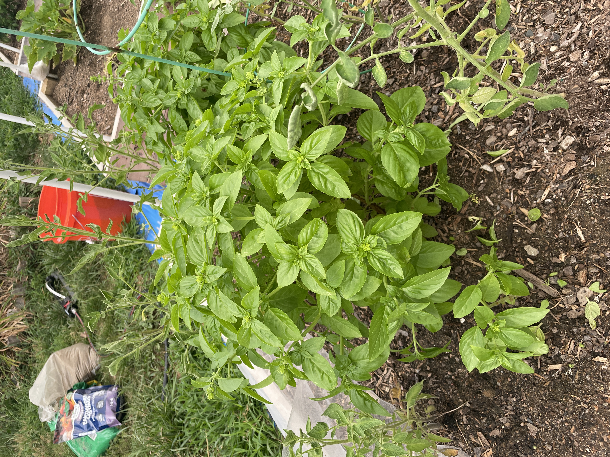

import ResponsiveImage from '@site/src/components/ResponsiveImage';
import Basil1Image from './assets/basil1.JPG';
import Basil2Image from './assets/basil2.JPG';
import washedBasilImage from './assets/washedBasil.JPG';
import basilSyrup1Image from './assets/basilSyrup.JPG';
import basilSyrup2Image from './assets/basilSyrup2.JPG';

# Basil Simple Syrup: Straight from the Garden
{/* truncate */}
## Recipe

### Ingredients
- 1 cup water
- 1 cup sugar
- 1 cup fresh basil leaves, lightly packed and washed.

### Prep Time
5 minutes

### Cook Time
5 minutes + 30 minutes steeping

### Yield
About 1½ cups

### Instructions
1. In a small saucepan, combine water and sugar.
2. Heat over medium heat, stirring until sugar completely dissolves.
3. Just as the mixture comes to a boil, remove from heat.
4. Add the fresh basil leaves and stir to submerge.
5. Cover and let steep for 30 minutes.
6. Strain through a fine mesh strainer into a clean glass jar or bottle.
7. Let cool completely before sealing.
8. Store in the refrigerator for up to 1 month.

### Notes
- **Important:** Don't boil the basil leaves directly in the syrup - add them after removing from heat to prevent browning and bitter flavors.
- For a stronger basil flavor, gently bruise the leaves before adding.
- This syrup has a beautiful light green tint when fresh.

## From My Garden to Glass

Basil's been taking over my garden, and I'm not complaining! I figured it was time to throw some into a syrup and see what happens. This basil simple syrup is super easy to make, smells amazing, and works in just about anything. Cocktails, sodas, lemonades or even over fruit (try watermelon!)
{/*  */}
<ResponsiveImage 
  src={Basil1Image}
  alt="Basil1Image"
  width="400px"
/>

<ResponsiveImage 
  src={Basil2Image}
  alt="Basil2Image"
  width="400px"
/>

The fragrant aroma that fills your kitchen while making this syrup is reason enough to try it.

<ResponsiveImage 
  src={washedBasilImage}
  alt="washedBasil"
  width="400px"
/>
After harvesting, I gave these lil dudes a gentle rinse. Look at that vibrant color! Fresh basil is incredibly fragrant. Just handling it releases those essential oils that give it such distinctive character. When selecting basil for syrup, I look for the most vibrant, unblemished leaves to ensure the cleanest flavor in the final product.

<ResponsiveImage 
  src={basilSyrup1Image}
  alt="basilSyrup1Image"
  width="400px"
/>

<ResponsiveImage 
  src={basilSyrup2Image}
  alt="basilSyrup2Image"
  width="400px"
/>
The transformation is complete! Thee fragrance alone makes it a showstopper in any drink. When held to the light, you can see the beautiful clarity with just a hint of that signature basil green.
What photos don't capture is the aroma - opening the bottle releases a sweet herbaceous scent that perfectly balances the sugar's sweetness with basil's aromatic complexity. Each batch varies slightly in color and intensity based on your basil variety and how long you steep the leaves.