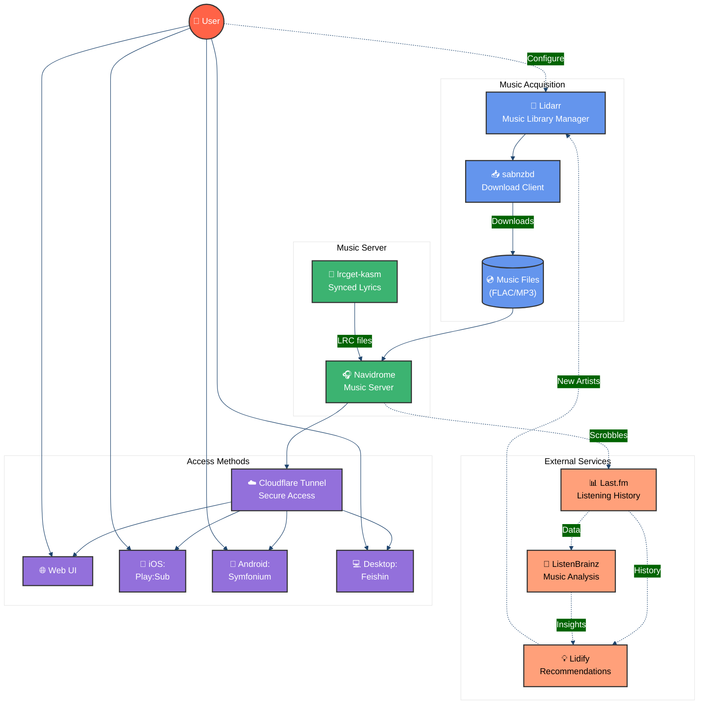

{/* truncate */}

import ResponsiveImage from '@site/src/components/ResponsiveImage';
import feishin from './assets/feishin.png';
import lidarr from './assets/lidarr.png';
import lidify from './assets/lidify.png';
import lrcget from './assets/lrcget.png';
import navidrome from './assets/navidrome.png';

## Why I Ditched Spotify, and How I Set Up My Own Music Stack
For years, I relied on Spotify like millions of others. The convenience was undeniable stream anything, anywhere, discover new music through algorithms, and share playlists with friends. But over time, several issues became impossible to ignore: [artists getting paid fractions of pennies per stream](https://en.wikipedia.org/wiki/Criticism_of_Spotify#Allegations_of_unfair_artist_compensation), [fake Artists and ghost Tracks](https://en.wikipedia.org/wiki/Controversy_over_fake_artists_on_Spotify), [AI music and impersonation](https://www.musicradar.com/music-tech/recording/ill-never-be-able-to-sing-that-perfectly-in-tune-but-i-dont-want-to-im-human-meet-the-real-artists-that-are-victims-of-ai-fake-tracks), [creepy age verification complicity](https://www.techradar.com/audio/spotify/spotify-introduces-face-scanning-age-checks-for-uk-uses-as-some-furious-fans-threaten-to-return-to-piracy) and the fact that despite paying monthly, I never actually owned anything.
So I decided to take back control of my music experience. Here's how I built my own self-hosted music streaming setup that gives me everything Spotify offered and more.

:::tip

There are components of this post which may be improved if you zoom in with your device. The mermaid diagram and code blocks in particular may be hard to read on smaller screens.

:::

## High Level Overview

## The Components

### Music Player: Navidrome

At the core of my setup is [Navidrome](https://www.navidrome.org/docs/installation/docker/), an open-source music server that handles streaming your personal music collection.

<ResponsiveImage 
  src={navidrome}
  alt="navidrome"
  width="100%"
/>

To access my music from anywhere, I expose Navidrome via a [CloudFlare Tunnel](https://developers.cloudflare.com/cloudflare-one/connections/connect-networks/), which provides secure access without exposing my home IP address or dealing with port forwarding.

For client apps, I use:
- Browser: Navidrome's built-in web player works perfectly
- iOS: [Play:Sub](https://apps.apple.com/us/app/play-sub-music-streamer/id955329386) connects seamlessly
- Android: [Symfonium](https://symfonium.app/) offers excellent playback quality and features
- Desktop: [Feishin](https://github.com/jeffvli/feishin) provides a native app experience with synced lyrics

<ResponsiveImage 
  src={feishin}
  alt="feishin"
  width="100%"
/>

:::tip Definition

**Scrobbling**: (Internet slang) To publish one's music-listening habits to the Internet via software, in order to track when and how often certain songs are played.

:::

Every track I play through this setup automatically scrobbles to my [Last.fm](https://www.last.fm/user/dudelaaaa) account, which becomes important for music discovery later.

### Music Collection Management: Lidarr

<ResponsiveImage 
  src={lidarr}
  alt="lidarr"
  width="100%"
/>

[Lidarr](https://github.com/Lidarr/Lidarr) helps manage my music collection by tracking artists and albums I own or purchase. It can monitor for new releases from favorite artists and helps organize my library.

:::warning
Lidarr is just a tool. Like any tool, it can be misused. 
Yes, people *could* point it at less-than-legal sources. No, I'm not telling you to do that. 
If you want to support artists, buy their work. If you don't, don't pretend Spotify streams are "support."
:::

**Important Note**: Always ensure you're obtaining music through legal channels such as:
- Digital purchases (Bandcamp, iTunes, Amazon, etc.)
- Ripping CDs you've purchased
- Free legal downloads offered by artists
- Music available under Creative Commons licenses

My setup uses [sabnzbd](https://hub.docker.com/r/linuxserver/sabnzbd) integrated with Lidarr for handling downloads of content I've purchased. Both services run in Docker containers and are NOT exposed to the internet for security.

### Synced Lyrics: lrcget-kasm

<ResponsiveImage 
  src={lrcget}
  alt="lrcget"
  width="100%"
/>

A feature I missed from Spotify was synced lyrics. [lrcget-kasm](https://github.com/ShadowsDieThrice/lrcget-kasm) fills this gap by mass-downloading LRC synced lyrics files for my music library.

Since lrcget is GUI-only (no CLI version yet), I'm using a containerized version of it via [Kasm](https://www.kasmweb.com/) and access it through my browser. It's a bit resource-intensive, so I only run it when adding new music or updating lyrics.

I've opened a [feature request](https://github.com/tranxuanthang/lrcget/discussions/245) for a CLI version, which would make this process more automation-friendly.

### Music Discovery: Lidify

<ResponsiveImage 
  src={lidify}
  alt="lidify"
  width="100%"
/>

One of Spotify's strongest features was music discovery. For this, I use [Lidify](https://github.com/TheWicklowWolf/Lidify), which connects to my Lidarr library and Last.fm account to generate recommendations.

I've also connected my Last.fm scrobbles to [ListenBrainz](https://listenbrainz.org/user/leshicodes/), which promises to build weekly discovery playlists similar to Spotify's in the future.

## The Results

After several months with this setup, I'm extremely satisfied with the results:
### How My Solution Compares to Spotify

| Feature | Spotify | My Self-Hosted Stack |
|---------|---------|----------------------|
| Music Quality | Up to 320kbps | Unlimited (FLAC/lossless) |
| Monthly Cost | $9.99-$14.99 | One-time server setup + storage |
| Artist Payment | ~$0.003-0.005 per stream | Direct support via purchases |
| Music Ownership | Rental only | Full ownership forever |
| Offline Access | Limited downloads | Complete library available |
| Privacy | Data collection & tracking | Complete privacy |
| Content Permanence | Can disappear anytime | Never removed unless I choose |

The initial setup took a weekend, but maintenance is minimal. When I want new music, Lidarr handles it automatically. If I need to manually add something, I just drop the files in the right folder and Navidrome indexes them immediately.

Is it for everyone? No. But if you care about music, value ownership, and have basic technical skills, building your own music streaming solution is both achievable and rewarding. The freedom from corporate streaming platforms is worth the effort.

## Supporting Artists

Moving away from Spotify doesn't mean abandoning artists. In fact, I now support musicians more directly by:

- Purchasing music directly from platforms like Bandcamp where artists receive 82-90% of sales
- Buying physical media from official stores
- Supporting Patreon/subscription services for favorite artists
- Attending concerts and buying merchandise

My self-hosted setup is about controlling my listening experience and owning what I pay for, not avoiding fair compensation to artists.

## What's Next?

I'm continually refining this setup. Future improvements include automating the lyrics process and exploring more discovery tools. The beauty of a self-hosted solution is that it can evolve with my needs, rather than changing at the whim of a company's business model.